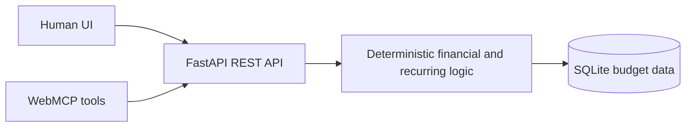

# Olos-AI Mini Budget Planner

**Olos Personal Budget Tracker** — one deterministic budget application with two first-class interfaces: a calm visual UI for people and structured WebMCP tools for compatible agents.

A small, local-first personal budget and cashflow planner for one person. It records income, expenses, bills and savings; projects recurring commitments; optionally tracks simple credit/pay-later balances; and shows what is approximately available after known plans. It is not accounting, tax, banking, investing or financial-advice software.

The application has no telemetry, advertising, bank integration, cloud login or external AI dependency. Financial calculations use deterministic Python logic and integer cents. Voice is optional and only prepares an editable draft.

## Why WebMCP

An application does not need an embedded chatbot or an LLM dependency to become agent-native. This branch registers a compact, typed capability surface with `document.modelContext.registerTool(...)`. A compatible agent can read or update the same budget the person sees, while every mutation still passes through the existing validated REST and domain logic.

That makes interactions such as these structural instead of screen-scraped:

- “I spent $87.40 on groceries using my credit card. Record it.”
- “What bills are due before the end of the month?”
- “Record my car repayment.”
- “How much credit is available across my accounts?”
- “Show Olos-AI work expenses from this month.”
- “Correct transaction 14 to $62.40.”

No tool transfers money, invents transactions, offers financial advice, or sends budget data to an AI service from the application.

## Architecture



The WebMCP file is an adapter, not a second budget engine. The frontend and API share one server; normal personal mode remains local-first.

## WebMCP tools

| Tool | Purpose |
| --- | --- |
| `get_budget_summary` | Monthly cashflow plus separate revolving-credit and fixed-loan positions |
| `list_upcoming_items` | Bounded recurring projections |
| `list_recent_activity` | Filtered, bounded actual transactions |
| `list_credit_and_loans` | Credit, Pay Later, and fixed-loan state |
| `get_calendar_month` | Structured month projection data |
| `add_transaction` | Add a confirmed expense, income, bill, or savings record |
| `create_recurring_item` | Add a rule through the existing recurrence model |
| `record_recurring_item` | Record one occurrence, including a linked loan payment |
| `record_credit_payment` | Reduce revolving debt and record cashflow once |
| `update_transaction` | Correct an ordinary transaction by stable ID |
| `delete_transaction` | Deliberately delete an ordinary transaction with exact confirmation |

Read tools are marked read-only. Tool results that can include user-entered descriptions are marked as untrusted content. Current WebMCP does not define a destructive annotation, so deletion additionally requires `confirmation: "DELETE"`.

Quick Add keeps an entered amount, description, date and note when the transaction type changes, while clearly relabelling the entry. A default category changes to the new type; a custom category/tag is preserved. Expense categories include lightweight `Work`, `Business`, and `Olos-AI` options.

## Prerequisites and first run

- Windows 10 or 11
- Python 3.11 or newer available as `python`
- Internet access on the first run only, so Python packages can be installed

From PowerShell in this folder:

```powershell
.\run.ps1
```

Or double-click `run.bat`. The first run creates a private `.venv`, installs the pinned Python requirements, creates the schema and default categories, then starts the app. Open [http://localhost:8765](http://localhost:8765). Stop it with `Ctrl+C`. Run `install-desktop-shortcut.ps1` once to create the **Olos Personal Budget Tracker** desktop launcher; it starts the local server and opens the app automatically.

No sample financial transactions are created.

## Hosted hackathon demo mode

Normal mode and hosted demo mode are deliberately separate:

- **Local personal mode** uses `data\olos-mini-budget.sqlite3`, creates no demo transactions, and stays on the user's computer.
- **Hosted demo mode** is enabled only with `OLOS_DEMO_MODE=true`. Each browser receives an opaque session cookie and a separate ephemeral SQLite database seeded only with a small synthetic story. Reset reseeds that one session; inactive session files expire. No local or real financial data is deployed.

The included `render.yaml` targets the free Render web-service tier, the `hackathon/webmcp` branch, `/api/health`, and disposable `/tmp` storage. Render authorization is still required before a live URL exists. Free services can cold-start after inactivity, so judges may see a brief initial wake-up.

## Phone and LAN use

Localhost-only is the default. To deliberately allow access on the current trusted local network:

```powershell
.\run.ps1 -Lan
```

The launcher prints a phone URL such as `http://<tower-ip>:8765`. Keep the computer and iPhone on the same trusted Wi-Fi, allow Python through Windows Firewall for **private networks only** if prompted, and enter the printed URL in Safari. Do not enable LAN mode on public Wi-Fi. Stop the server when finished.

The app does not create a public internet listener or configure port forwarding. A private overlay network such as Tailscale can carry the same HTTP connection, but is not required or configured by this app.

Browser speech recognition support varies. If the Speak button is unavailable or permission is denied, tap an ordinary text field and use the iPhone keyboard's dictation microphone. In either case, voice text becomes a draft and is never saved until Save is pressed.

## Data, export and restore

The live database is clearly located at:

```text
data\olos-mini-budget.sqlite3
```

The `data` directory is ignored by Git. Use **CSV** in Recent activity for a transaction export or **Backup** for a complete JSON backup. Files are downloaded by the browser and never uploaded anywhere. Under **Data and backup tools**, a JSON backup can be restored after an explicit confirmation. Restore replaces current financial records in one database transaction and rejects the same backup if submitted twice.

Back up the JSON file somewhere you control. Closing the server before directly copying the SQLite file is also safe.

## How monthly cashflow is calculated

All amounts are stored as integer minor units (AUD cents). Cash/debit expenses reduce current cash immediately. Credit/pay-later purchases still appear in spending and increase the selected facility's amount owed, but do not reduce cash until a repayment is recorded. For a selected month:

```text
expected remaining =
  actual income
  + unrecorded expected income
  - actual cash/debit expenses
  - actual paid bills
  - actual credit/pay-later repayments
  - actual fixed-loan repayments
  - unrecorded planned bills
  - actual savings
  - unrecorded planned savings
```

Recorded and skipped recurring occurrences are excluded from the planned totals, preventing double counting. Schedule definitions are projected as needed; thousands of future rows are not generated.

## Credit, Pay Later and Fixed Loans

The collapsed **Credit, Pay Later & Loans** section is optional. Revolving accounts store a limit and current amount owed; available credit is always calculated as `limit - owed` and is not stored separately. Their optional APR is display-only because statement cycles and lender rules vary.

For an expense, **Paid with** can be Cash, Debit, Credit or Pay Later. Selecting Credit or Pay Later also requires a matching account. The purchase remains one ordinary expense and raises that account's amount owed. A later **Payment** lowers the amount owed and records cash leaving on the payment date. The repayment is labelled separately and excluded from ordinary spending totals, preventing the purchase and repayment from being counted as two expenses.

A Fixed Loan stores an estimated balance, annual rate, balance date and optional link to one recurring bill. On a recorded payment, estimated daily simple interest is applied first:

```text
interest cents = round-half-up(balance cents × APR basis points × elapsed days ÷ (10,000 × 365))
new estimated balance = prior balance + interest - payment
```

Interest increases only the liability estimate; it does not create a cash expense. The one repayment transaction reduces cashflow once and reduces the linked loan once. **Edit balance** lets the lender's authoritative balance replace the estimate without adding a pseudo-expense. Fees, amortisation advice and lender-specific calculations remain out of scope.

## API

Interactive local API documentation is at [http://localhost:8765/api/docs](http://localhost:8765/api/docs). Principal endpoints cover transactions, recurring rules, 30-day and calendar projections, occurrence recording/skipping, credit facilities and payments, monthly summaries, voice-text parsing, CSV/JSON export and confirmed restore.

Inputs are validated with Pydantic, SQL uses parameters, user text is escaped in the browser, CORS is not enabled, and the database file is not served. No secrets are stored. LAN mode has no account system, so it must only be used on a trusted private network.

## Development and tests

Backend:

```powershell
.venv\Scripts\python.exe -m unittest discover -s tests -p "test_*.py" -v
```

Frontend behaviour and syntax:

```powershell
npm.cmd run test:frontend
```

The dependency-free browser application can be syntax-checked with:

```powershell
npm.cmd run build
```

WebMCP registration and execution tests use a simulated browser host and real adapter functions; backend integration tests cover the shared financial paths and two-session demo isolation. For an actual compatible Chrome test, enable WebMCP testing in Chrome 149+ and inspect/call the registered tools through DevTools, or use ChatGPT's WebMCP-capable in-app browser.

## Hackathon provenance

The stable pre-WebMCP product is preserved on `main` at commit `3b937556a1c26116ec59487f0e30d2a86e42a428`. Challenge work is isolated on `hackathon/webmcp`. See [docs/WEBMCP_CHALLENGE.md](docs/WEBMCP_CHALLENGE.md) for API assumptions, safety decisions, testing, and known limitations.

Public repository: <https://github.com/oscarcybermonk/olos-ai-mini-budget-planner>

License: [MIT](LICENSE).

## Future Apple-client direction

A later SwiftUI iPhone, iPad or macOS client can call the same REST API, leaving money and recurring calculations in the existing backend. A Watch or Siri/Shortcuts quick-entry companion could capture speech natively, send only the resulting text to the local parser, and still require confirmation. No Apple-native client is included in this phase.

See [docs/PRODUCT_STATUS.md](docs/PRODUCT_STATUS.md) for exact scope and limitations.
